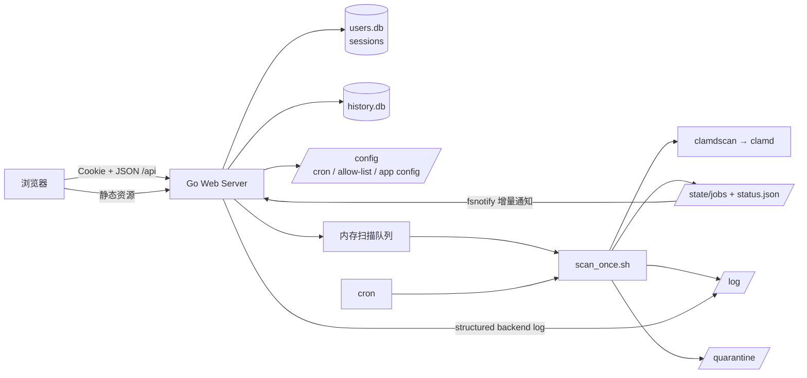

# ClamAV-Web 开发指南

本文面向维护者和贡献者，说明项目边界、前后端协作方式、运行链路与常用开发操作。用户部署说明请参阅 [README.md](README.md)，完整接口契约请参阅 [server/api.md](server/api.md)。

## 项目概览

ClamAV-Web 是一个单镜像应用：上游 `clamav/clamav:stable_base-debian` 提供扫描引擎与病毒库更新，项目在其上增加 shell 编排、Go Web API、React 管理界面和 cron 调度。

| 层 | 技术与职责 |
| --- | --- |
| 容器与编排 | Docker 多阶段构建；`startup.sh` 同时监管 ClamAV、cron 和 Go 服务。 |
| 扫描执行 | POSIX shell 调用 `clamdscan`，写入任务状态、日志、锁和隔离结果。 |
| 后端 | Go 1.25、标准库 `net/http`、SQLite（`modernc.org/sqlite`）、fsnotify、Argon2id。 |
| 前端 | React 19、TypeScript、Vite 8、Tailwind CSS 4、Base UI / shadcn 风格组件。 |
| 持久化 | 文件系统中的配置、状态、日志与隔离文件；SQLite 保存用户、session 与历史索引。 |

## 架构与数据流



关键约束：

- 手动扫描经 Go 的内存队列串行执行；cron 任务也通过扫描锁与它协调。重启后等待中的内存任务不会恢复。
- 前后端只允许访问 `/scan`。浏览 API 隐藏符号链接，所有接收文件路径的业务 API 都拒绝包含符号链接的路径；`IS_TIMEDOCK=Y` 时还会按登录用户的 `timedock_account` 追加目录限制。
- 业务资源按不可变的 `users.id` 隔离，用户名只用于登录、显示和日志。admin 不是“全局数据查看者”，只额外拥有用户管理、服务配置和 ClamAV 全局控制权限。
- 正在扫描时，白名单变更、部分清理与账户删除会受锁或状态约束，避免破坏运行中的任务。

## 目录导览

```text
.
├── Dockerfile                 # 前端构建 → Go 编译 → ClamAV 运行镜像
├── startup.sh                 # PID 1：初始化、启动、监控与优雅关闭
├── scan_once.sh               # 单次扫描、任务文件、日志、检出处理
├── cron.sh / config.sh        # cron 规则生成、加载与校验
├── exclude.sh                 # 从 exclude.conf 生成 ClamAV 排除项
├── config/                    # 镜像内置的默认配置示例
├── server/                    # Go API、认证、SQLite、队列和业务逻辑
│   ├── main.go                # 服务装配与路由
│   ├── auth.go / users.go     # 账户、session、登录限制与 admin 管理
│   ├── scans.go / cron.go     # 手动队列与定时规则
│   ├── whitelist.go           # SHA-256 allow-list
│   ├── history_*.go           # 历史索引、查询与统计
│   ├── quarantine.go          # 隔离查询、恢复和清理
│   ├── internal/applog/      # Go 日志等级、脱敏、并发写入与轮转
│   ├── api.md                 # API 契约
│   └── server_conf.md         # 运行时服务配置说明
└── ClamAV-Web/                # React 前端
    └── src/features/          # 按页面拆分的业务功能
```

`frontend/` 与 `server/web/src/` 是历史前端目录；当前生产前端唯一来源是 **`ClamAV-Web/`**。Dockerfile 只会构建该目录，并将 `dist/` 复制到 Go 的 `server/web/dist` 嵌入路径。

## 启动链路

1. Docker 前端阶段在 `ClamAV-Web/` 执行 `npm ci && npm run build`。
2. Go 阶段复制 `server/*.go`、`server/internal/` 和前端 `dist/`，以静态链接方式编译 `/server`。
3. 运行阶段的 `startup.sh` 创建持久化目录和缺失配置，校验 cron，生成排除规则。
4. `startup.sh` 启动上游 `/init`，等待 `clamd` 可 ping。
5. 就绪后重载 cron、以后台进程启动 cron 与 Go 服务；任一受监管服务意外退出，容器结束。

`/startup.sh --wake` 是管理员唤醒 ClamAV 时使用的专用路径：它只重启/确认 ClamAV 并清除休眠锁，不会重复启动 Web 服务或 cron。

## 后端设计

### 路由、认证与授权

路由在 [server/main.go](server/main.go) 注册，并统一经过 `requireAuth`：

- 匿名接口仅有首次运行状态、首次管理员注册和登录。
- 登录成功后下发 `clamavweb_session` Cookie；Cookie 为 `HttpOnly`、`SameSite=Strict`，绝对有效期 24 小时、空闲有效期 2 小时。
- 非安全方法会校验 `Origin` 与请求 Host 一致，以降低跨站请求风险。
- `/api/admin/*` 和 ClamAV 休眠/唤醒额外要求 admin。

密码使用 Argon2id 和每个密码独立 salt，当前参数每次运算约占用 19 MiB 工作内存。所有由
HTTP 请求触发的 Argon2id 哈希与校验共享 5 个并发槽位，满载时立即返回 `429`，以将这部分
峰值工作内存约束在 95 MiB。登录限流以客户端 IP 和全局十分钟窗口计数；可信反向代理的
取 IP 规则不可自行假设，必须遵守 [server/server_conf.md](server/server_conf.md) 中的
`SERVER_TRUSTED_REVERSEPROXY` 定义。

HTTP Server 使用固定的连接级安全边界：请求头读取最多 10 秒、完整请求读取最多 30 秒、
keep-alive 空闲最多 60 秒，请求头最多 64 KiB。响应写入上限为 25 分钟，特意高于 ClamAV
唤醒流程的 21 分钟上限。这些值不是运行时配置项；直接暴露服务时由 Go 后端兜底，使用反向
代理时应在代理侧设置相当或更严格的限制。

Go 服务统一为静态资源、API 和错误响应设置 MIME 嗅探、点击劫持、CSP、Referrer Policy
和 Permissions Policy 防护。CSP 仅允许同源脚本和连接；React 动态样式需要
`style-src 'unsafe-inline'`。HSTS 不由后端发送，应由确认始终使用 HTTPS 的反向代理配置。

### 状态与持久化

| 位置 | 所有者 | 内容 |
| --- | --- | --- |
| `/data/users.db` | Go | users、密码哈希、sessions。 |
| `/data/history.db` | Go | 由任务 JSON 增量更新、并可周期重建的历史索引。 |
| `/state/jobs/*.json` | shell | 每次扫描的版本化任务状态。 |
| `/state/status.json` | shell | ClamAV 与最近扫描状态。 |
| `/config/cron_scan.conf` | Go + shell | 带元数据的定时扫描规则。 |
| `/config/exclude.conf` | Go + shell | 信任区相关的文件哈希与规则来源。 |
| `/config/clamavweb.conf` | Go | 服务配置；日志三项只在启动时读取，其他管理项支持 API 更新。 |
| `/log/clamavweb.log*` | Go | 结构化后端日志及按大小轮转的历史文件。 |
| `/log` 其余文件、`/quarantine` | shell | 启动/扫描/检出日志与隔离文件。 |

不要绕过 API 直接修改这些文件，除非同时理解对应的锁、格式校验和重载流程。例如，cron 文件必须经 `cron.sh reload` 校验并生成 `/etc/cron.d/clamav-scheduled-scan`。

### 历史索引同步

服务启动时会完整扫描一次 `/state/jobs/*.json`。运行期间，Go 后端通过 fsnotify 监听任务目录，对新增、替换、修改或删除的 JSON 文件进行去抖后的单文件索引，因此 shell 和 cron 创建的任务无需等待下一次周期刷新。

`HISTORY_INDEX_REFRESH_INTERVAL` 仍控制周期完整刷新，作为丢失文件事件或监听不可用时的可靠性兜底。完整刷新会一次性加载数据库内全部文件 mtime，在内存中与目录内容比对；mtime 未变化的 JSON 不会重新解析，数据库中不再存在的文件会被清除。

管理 API 更新该间隔后会通过容量为一的通知 channel 唤醒索引循环；索引循环停止并排空旧
timer 后按最新配置重新计时。连续快速修改会合并通知，但每次处理都读取最后一次成功持久化
的值。

监听初始化失败时按 5、10、20、40、60 秒阶梯退避，达到 60 秒后保持该间隔；每次失败都会写入完整错误、次数与下次等待时间。连续失败 10 次会停止监听、写入 error，并继续使用周期完整刷新。运行中的 watcher 每次报错也会写入 warn 并请求完整刷新，但重复刷新请求会合并，最多每 60 秒执行一次；正常的单文件事件不受该限流影响。

### ClamAV 定时休眠

`sleep_wake.go` 独占自动休眠 timer。服务启动、配置变更、手动唤醒和每个手动扫描子进程成功
启动时，只通过容量为一的通知 channel 请求重置；业务 goroutine 不直接操作 timer。调度器
同时维护同步递增的 generation，到期并获得 `clamavPowerMu` 后再次核对 generation，避免旧
到期事件关闭刚开始扫描的 clamd。

到期休眠复用 `sleepClamAV`，因此仍受跨进程扫描锁保护。内存手动队列中存在等待或运行任务
时也会延后休眠。成功休眠后 timer 暂停；扫描冲突或临时错误按完整配置间隔重新计时。
`CLAMAV_SLEEP_TIMER=0` 表示关闭；管理 API 使用数值 `0` 表达相同状态，不接受空字符串。

### 后端日志

`server/internal/applog` 基于标准库 `log/slog`，是 Go 后端唯一的文件日志入口。业务模块只提交等级、消息和结构化
字段；日志包统一负责过滤、单行转义、敏感字段兜底识别和轮转。明确的敏感值必须通过
`applog.Secret(key, value)` 标记，业务代码不得自行拼接掩码。日志包仍会按字段名二次检查，
防止普通键值调用意外泄漏密码、token、Cookie、Authorization 或 secret。

日志配置来自 `clamavweb.conf`，只在进程启动时生效。`LOG_FILE_NUM` 包含当前文件；轮转由
日志包互斥执行，因此 HTTP handler、扫描 worker 和历史 watcher 可以并发记录。轮转或写入
失败时直接回退到 stderr，不能再次调用日志包形成递归。HTTP 日志中的 `peer_ip` 始终来自
`RemoteAddr`；`client_ip` 则使用与登录限流相同的可信代理规则，并额外记录来源类型。

### 异步查询模式

历史记录、统计和隔离区查询采用“创建 lookup → 轮询结果”的模式，避免大目录或大量任务阻塞 HTTP 请求。三类查询共享每用户两个 pending 配额和 30 秒执行超时；每个用户最多保留 10 个 lookup。服务级 context 负责退出取消，统一 janitor 每分钟清理，创建请求也会执行相同的过期清理。terminal 结果保留 15 分钟，账户删除会取消并移除该用户的 lookup。

结果列表的数字分页范围单次最多 500 条；统计范围仍为 1–31 天。隔离区不使用 `scope`，通过分批目录读取响应取消，但仍返回当前用户的完整条目列表。lookup 存在内存中，重启即失效；前端调用时应接受 `202` 并轮询对应资源，具体请求形状见 API 文档。

## 前端设计

入口在 `ClamAV-Web/src/main.tsx`，应用壳在 `src/App.tsx`。前端使用多 HTML 入口：

- `/`：已登录后的主控制台；
- `/login/`：登录；
- `/first_run/`：首次管理员注册与初始化。

页面功能在 `src/features/` 中按域拆分；可复用布局与组件位于 `src/components/`，HTTP 封装在 `src/lib/api.ts`，类型定义在 `src/lib/types.ts`。页面切换使用 URL hash，而不是前端路由库。

`api()` 始终以 `credentials: "same-origin"` 请求；后端返回 `401` 时会分发 `clamav-auth-expired` 事件并回到登录页。新增需要写入的接口时，优先复用 `jsonRequest()` 与 `ApiError`，保持错误呈现和 session 过期行为一致。

## 本地开发

### 前置条件

- Docker（建议用于完整扫描链路）；
- Go **1.25+**；
- Node.js 与 npm（锁定依赖使用 npm）；
- 运行后端时可用的 ClamAV、cron、脚本及对应目录结构。

### 前端

```sh
cd ClamAV-Web
npm ci
npm run dev
```

Vite 固定监听 `http://127.0.0.1:5174`，将 `/api` 代理到 `http://127.0.0.1:8080`。后端地址不同时：

```sh
cd ClamAV-Web
VITE_API_PROXY_TARGET=http://127.0.0.1:9000 npm run dev
```

常用检查：

```sh
cd ClamAV-Web
npm run typecheck
npm run lint
npm run build
```

> `npm run format` 会改写文件；请只在明确需要格式化时运行。

### 后端与完整环境

后端依赖容器内的默认路径（如 `/scan_once.sh`、`/state`、`/config` 和 `clamd`），因此最可靠的端到端环境是完整 Docker 镜像：

```sh
docker build -t clamav-web:dev .
docker run --rm -p 8080:8080 \
  -e ADMIN_REGISTER_TOKEN='development-only-token' \
  -v "$(pwd)/config:/config" \
  -v "$(pwd)/data:/data" \
  -v "$(pwd)/scan:/scan" \
  -v "$(pwd)/quarantine:/quarantine" \
  -v "$(pwd)/log:/log" \
  -v "$(pwd)/state:/state" \
  clamav-web:dev
```

单独运行 Go 服务适合纯 HTTP 或单元测试，但需要显式提供脚本、目录和 ClamAV 依赖；不要把它误当作可独立完成真实扫描的开发模式。

## 测试与验证

```sh
cd server
go test ./...
```

修改前端后至少执行 `npm run typecheck` 和 `npm run build`；修改镜像、shell 或嵌入产物后至少执行一次 `docker build`。涉及扫描、隔离、恢复或权限的变更，建议在隔离测试目录用 EICAR 测试文件验证，切勿在重要数据上直接验证 `move` 或 `remove`。

测试文件主要覆盖配置解析、数据库拆分、首次运行、登录限流、多用户隔离、扫描队列、cron 唤醒、休眠/唤醒和历史统计。API 集成测试可通过 `SCANNER_TEST_SERVER` 指向已运行的测试服务，详见 `server/api_test_server.md`。

## 开发约定与常见陷阱

- 保持 API 的用户隔离：新资源必须绑定当前 `actor.ID`，用户名只用于显示和日志；跨用户访问最好返回 `404`，不要泄露资源存在性。
- 路径输入必须使用现有安全路径校验，不能自行拼接 `/scan` 字符串。
- 扫描和白名单操作必须尊重锁；不要引入绕过串行调度的直接扫描路径。
- cron 规则需要兼容带空格的目标路径、owner 与 `wake` 标志。不要直接手写 `/etc/cron.d`。
- SQLite 结构或数据迁移应保持幂等，并兼顾已存在的持久化数据库。
- 生产资源由 Go `embed` 提供。只修改 React 源码而不构建前端，最终镜像不会得到更新。
- Dockerfile 会复制 `server/*.go` 和 `server/internal/`；新增其他后端子包或非 Go 运行资源时，应同步审查 COPY 规则。

## 文档索引

| 文档 | 内容 |
| --- | --- |
| [README.md](README.md) | 产品介绍、部署与使用说明。 |
| [server/api.md](server/api.md) | 全部 HTTP API、状态码与请求/响应示例。 |
| [server/server_conf.md](server/server_conf.md) | `/config/clamavweb.conf` 与相关环境变量。 |
| [server/api_test_server.md](server/api_test_server.md) | 面向运行中服务的 API 测试说明。 |
