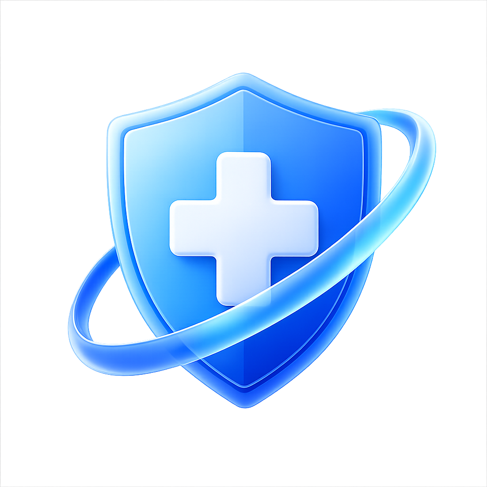
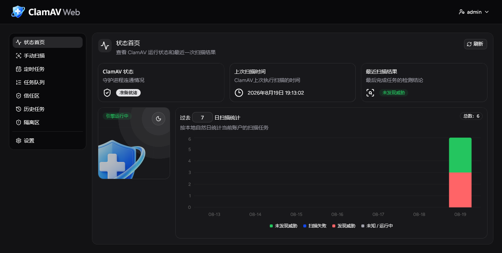
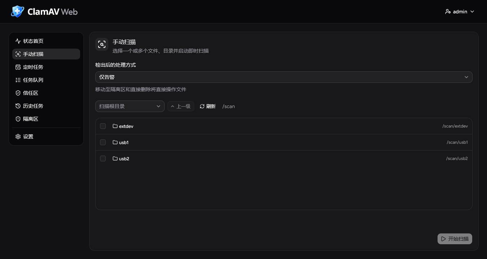
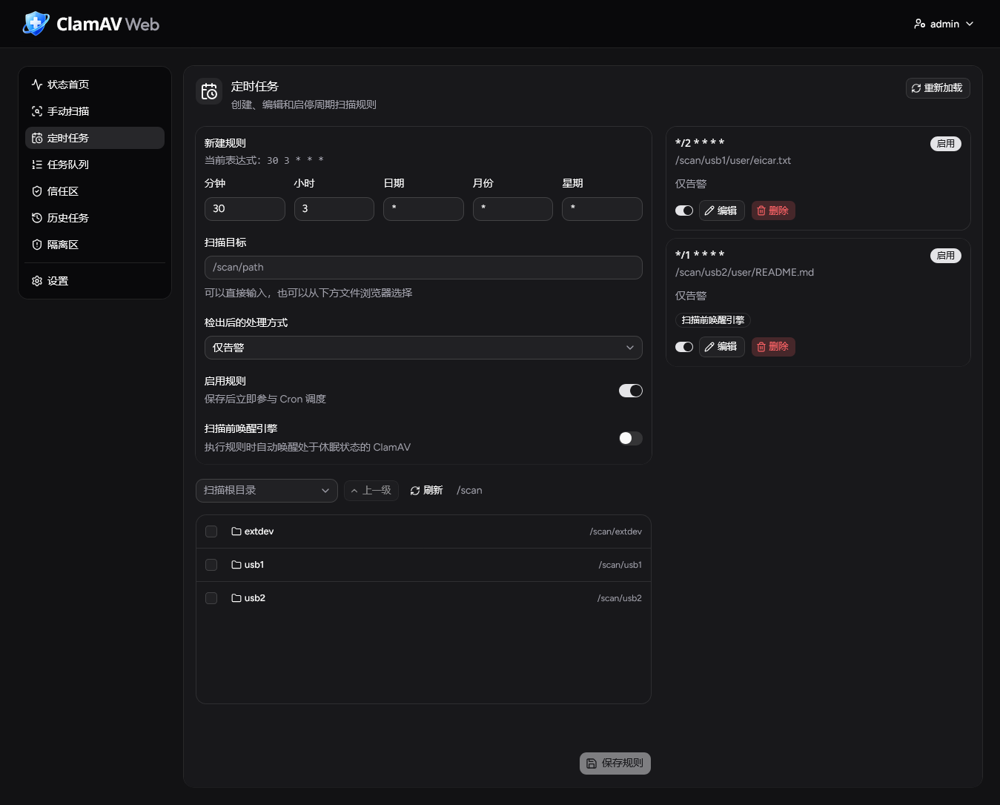
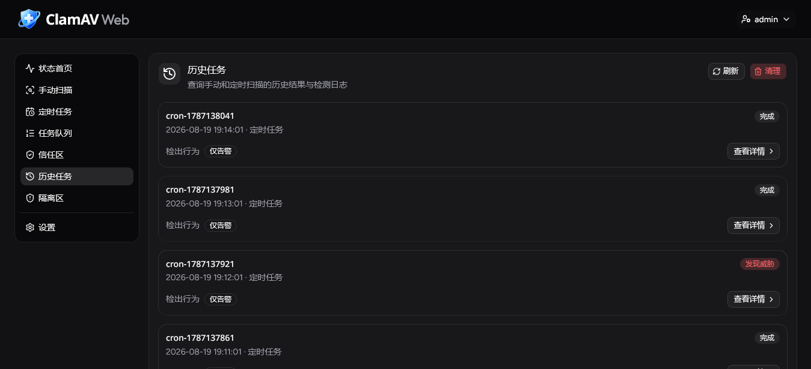
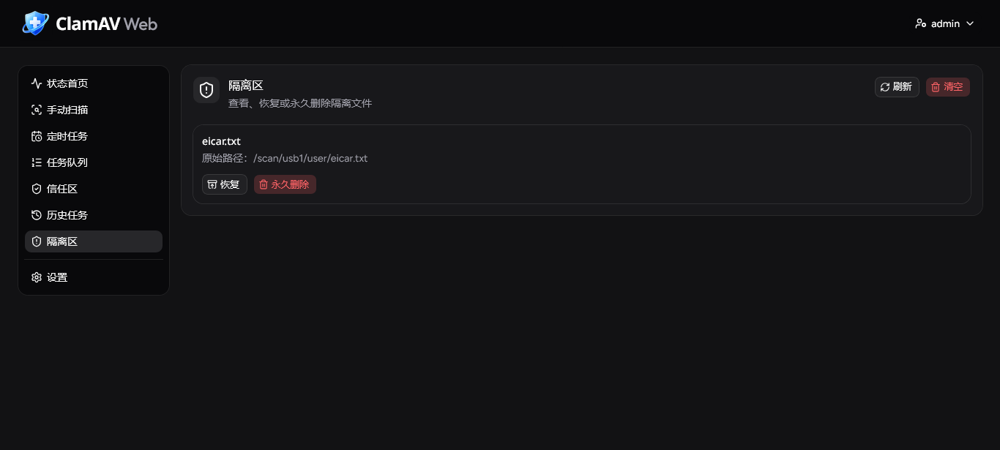

<div align="center">



<h1>ClamAV-Web</h1>

**为 [ClamAV](https://www.clamav.net/) 容器提供的 Web 管理、任务调度与多用户工作台**

[](https://github.com/DrJason33564/ClamAV-Web/releases)
[](https://hub.docker.com/r/tinkerbell37745/clamav-timedock)
[](https://hub.docker.com/r/tinkerbell37745/clamav-timedock)
[](https://github.com/DrJason33564/ClamAV-Web/commits)
[](LICENSE)

[](server/go.mod)
[](ClamAV-Web/package.json)

[GitHub](https://github.com/DrJason33564/ClamAV-Web) · [Docker Hub](https://hub.docker.com/r/tinkerbell37745/clamav-timedock) · [快速开始](#-快速开始) · [开发](DEV.md) · [API](server/api.md)

</div>

ClamAV-Web 将 ClamAV 的扫描能力、定时任务和结果处理整合为一个浏览器可用的管理界面。它以单个 Docker 镜像运行：内含 ClamAV、Go 后端、React 前端和 cron 调度服务，适合家庭服务器、小型团队与NAS场景。

> 本项目负责管理、编排与展示；病毒检测和病毒库更新仍由上游 `clamav/clamav` 完成。

## 📸 界面预览

<table>
  <tr>
    <td align="center" width="50%"><br>ClamAV 状态与扫描统计</td>
    <td align="center" width="50%"><br>文件浏览与扫描提交</td>
  </tr>
</table>

<table>
  <tr>
    <td align="center" width="33.33%"><br>cron 规则管理</td>
    <td align="center" width="33.33%"><br>历史任务记录</td>
    <td align="center" width="33.33%"><br>隔离区</td>
  </tr>
</table>

## ✨ 功能一览

| 模块 | 能力 |
| --- | --- |
| 状态面板 | 查看 ClamAV 连通性、运行状态、最近扫描结果与统计；管理员可休眠或唤醒引擎。 |
| 手动扫描 | 在 `/scan` 中安全浏览并多选文件/目录，提交串行扫描任务。 |
| 定时任务 | 可视化创建、编辑、启停和重载五段 cron 规则。 |
| 任务与历史 | 调整等待队列、取消未开始任务；异步查询历史、日志、检出详情与统计。 |
| 文件处置 | 支持仅告警、移动至隔离区、直接删除；隔离文件可恢复或永久清理。 |
| 信任区 | 以 SHA-256 生成 ClamAV allow-list，支持文件与目录递归加入。 |
| 多用户 | 内置 admin / user、Argon2id 密码哈希、Cookie session，以及用户间业务数据隔离。 |
| TimeDock 模式 | 适配拾光坞 NAS 的用户空间隔离机制，可将每个账号限制在指定的 `/scan` 子目录，避免越权浏览和提交路径。 |

## 🧱 工作方式

```text
浏览器
  │ React + Vite 构建的单页界面
  ▼
Go HTTP 服务（认证、权限、队列、API、SQLite 索引）
  ├── /scan_once.sh ──► clamd / ClamAV
  ├── /cron.sh ───────► Debian cron
  ├── /config         ──► 规则、白名单、服务配置
  └── /data /state /log /quarantine ──► 持久化数据与运行产物
```

生产构建会先编译 `ClamAV-Web/`，再将静态文件嵌入 Go 可执行程序；容器启动后由 `startup.sh` 协调 ClamAV、cron 和 Web 服务。扫描全局串行执行，防止多个任务同时挤占扫描引擎。

## 🚀 快速开始

### 1. 构建镜像

```sh
docker build -t tinkerbell37745/clamav-timedock .
```

### 2. 准备持久化目录

```sh
mkdir -p config data scan quarantine log state
```

将需要扫描的内容放入 `scan/`。默认情况下，Web 界面只能浏览和操作容器内的 `/scan`；文件浏览会隐藏符号链接，相关 API 也会拒绝包含符号链接的路径。

### 3. 启动服务

首次注册管理员必须设置一个非空的 `ADMIN_REGISTER_TOKEN`。请替换示例中的随机值，并妥善保管。

```sh
docker run -d \
  --name clamav-web \
  --restart unless-stopped \
  -p 8080:8080 \
  -e TZ=Asia/Shanghai \
  -e ADMIN_REGISTER_TOKEN='replace-with-a-long-random-token' \
  -v "$(pwd)/config:/config" \
  -v "$(pwd)/data:/data" \
  -v "$(pwd)/scan:/scan" \
  -v "$(pwd)/quarantine:/quarantine" \
  -v "$(pwd)/log:/log" \
  -v "$(pwd)/state:/state" \
  tinkerbell37745/clamav-timedock
```

访问 `http://<主机地址>:8080`。首次打开时，使用你设置的令牌注册首个账户；该账户会自动成为管理员。完成首次运行流程后，管理员可在界面中创建其他账户。

## 📦 持久化目录

六个目录都建议挂载到宿主机；容器需要读取 `/scan`，而隔离、删除和恢复还需要对它写入。

| 容器路径 | 用途 |
| --- | --- |
| `/scan` | 可浏览、扫描和处置的目标数据根目录 |
| `/quarantine` | 隔离文件与其原始路径记录 |
| `/config` | 定时规则、信任区、服务配置 |
| `/data` | 用户、会话、历史任务及结构化检出详情的 SQLite 数据库 |
| `/state` | 扫描任务 JSON、状态文件和锁 |
| `/log` | Go 后端、启动、cron、扫描与检出日志 |

## 🔐 安全与权限

- 密码以带独立随机 salt 的 **Argon2id** 哈希保存；认证使用 `HttpOnly`、`SameSite=Strict` 的 Cookie session。
- session 的绝对有效期为 24 小时，空闲有效期为 2 小时；登录接口有单 IP 与全局限流。
- 除首次状态、首次管理员注册和登录外，所有 API 都要求登录；浏览器中的写操作还必须同源。
- 用户的扫描队列、规则、信任区、历史、日志、查询任务和隔离区相互隔离。admin 只拥有用户与全局服务管理权，不能查看其他用户的业务数据。
- `move`、`remove`、清空历史与清空隔离区会修改或删除数据。建议先使用“仅告警”，并使用 EICAR 等安全测试样本验证流程。

如在 HTTPS 反向代理后部署，请设置 `SCANNER_COOKIE_SECURE=true`；若需要读取真实客户端 IP，只能在可信代理前提下配置 `SERVER_TRUSTED_REVERSEPROXY`。完整语义见 [服务端配置](server/server_conf.md)。

## ⚙️ 常用配置

| 配置 | 默认值 | 说明 |
| --- | --- | --- |
| `SCANNER_ADDR` | 空 | Web 服务监听地址；为空时监听全部 IPv4 和 IPv6 地址。IPv6 地址无需添加方括号。 |
| `SCANNER_PORT` | `8080` | Web 服务监听端口，仅填写不带冒号的端口数字。 |
| `ADMIN_REGISTER_TOKEN` | 无 | 首次管理员注册的必填令牌；推荐通过 Docker secret 注入。 |
| `SCANNER_COOKIE_SECURE` | `false` | HTTPS 反向代理后设为 `true`。 |
| `IS_TIMEDOCK` | `N` | `Y` 时启用 TimeDock 模式。 |
| `TZ` | 镜像默认值 | 页面时间与 cron 时区。 |
| `SCAN_WAIT_INTERVAL` | `30` | 定时任务等待扫描锁的重试间隔（秒）。 |
| `SCAN_WAIT_MAX_SECONDS` | `0` | 定时任务最大等待时间；`0` 为不限制。 |
| `USER_DATABASE_FILE` | `/data/users.db` | 用户与 session 数据库。 |
| `HISTORY_DATABASE_FILE` | `/data/history.db` | 历史任务索引数据库。 |
| `CLAMAV_SLEEP_TIMER` | `3600` | ClamAV 自动休眠间隔（秒）；配置文件或 API 设为 `0` 可关闭。 |
| `LOG_FILE_MAX_SIZE` | `5242880` | `/log/clamavweb.log` 单文件最大字节数。 |
| `LOG_FILE_NUM` | `5` | Go 后端日志文件总数（包含当前文件）。 |
| `LOG_LEVEL` | `warn` | Go 后端最低日志等级。 |

服务配置保存在 `/config/clamavweb.conf`，管理 API 可调整登录限制、历史索引间隔和 ClamAV 自动休眠时间，供前端设置页接入；日志配置需手工修改并重启服务，不通过界面或 API 暴露。配置项范围、默认值及反向代理规则见 [server/server_conf.md](server/server_conf.md)。

## 📖 使用要点

- **处理方式**：`warn` 只记录威胁；`move` 移至隔离区并可恢复；`remove` 直接删除，不能恢复。
- **定时规则**：使用五段 cron（分 时 日 月 周），支持范围、步长与逗号列表；保存后会校验并重载。
- **信任区**：白名单按内容 SHA-256 生效。文件变更后需重新添加；扫描执行时不能修改信任区。
- **队列**：等待任务可调整顺序或取消；容器重启后，内存中尚未开始的手动任务不会恢复。
- **隔离恢复**：若原路径已有同名文件，恢复会拒绝覆盖；恢复出的文件仍可能有风险。

## 🛠️ 开发与接口

前端源码位于 `ClamAV-Web/`，后端源码位于 `server/`。本地前端开发服务器监听 `http://127.0.0.1:5174`，并默认将 `/api` 代理到 `http://127.0.0.1:8080`。

```sh
cd ClamAV-Web
npm ci
npm run dev
```

```sh
cd server
go test ./...
```

更完整的架构、开发流程、测试与扩展约定，请阅读 [DEV.md](DEV.md)。请求与响应详情请阅读 [server/api.md](server/api.md)。

## 🙏 致谢

本项目开发中使用到了以下数个项目/开源仓库，致谢

- [shadcn/ui](https://ui.shadcn.com/) - 前端组件
- [Cisco-Talos/clamav](https://github.com/Cisco-Talos/clamav) - 杀毒引擎

## 📄 License

本项目采用 [MIT License](LICENSE)。
